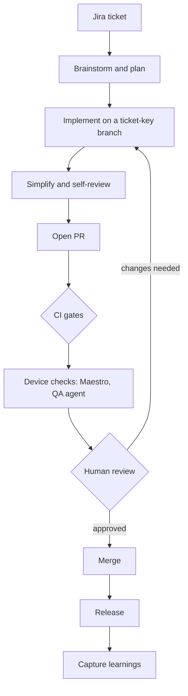

# Lifecycle: from Jira ticket to release

Every change follows the same path. Each stage says who acts, what goes in, what comes out, and the check that must pass before the next stage. The agent is Claude Code with the Compound Engineering plugin.

| Stage | Who acts | Input | Output | Exit check | Command |
|---|---|---|---|---|---|
| Ticket | Developer | Jira ticket | Understood scope | Ticket key known | none |
| Brainstorm and plan | Developer with agent | Ticket, or its text read via the optional Jira MCP | For anything beyond a small fix, a plan in `docs/plans/` | Developer agrees with the plan | `/compound-engineering:ce-brainstorm`, `/compound-engineering:ce-plan` |
| Implement | Agent, developer steers | Plan or ticket | Commits on a branch named `<TICKET-KEY>-short-name` | `npm run typecheck`, `lint`, `test`, `knip` pass | `/compound-engineering:ce-work` |
| Simplify and self-review | Agent | The diff | Diff with duplication and needless abstraction removed | Reviewer-ready diff; "Decisions weighed" written | `/compound-engineering:ce-simplify-code`, `/compound-engineering:ce-code-review` |
| Open PR | Developer | Branch | PR titled `<TICKET-KEY> short summary`, template filled | PR template complete | `/compound-engineering:ce-commit-push-pr` |
| CI gates | CI | PR | Typecheck, lint, tests, knip, secret scan, ticket-key check results | All required checks green | none |
| Device checks | CI | PR build | Maestro results now; QA agent report with screenshots once it exists | Maestro green; when the QA agent exists, its check green or an inconclusive run acknowledged by a reviewer | none |
| Human review | Reviewer | PR, checks, QA evidence | Approval or requested changes | Approval from a code owner | none |
| Merge | Developer | Approved PR | Change on the main branch | Branch protection satisfied | none |
| Release | A maintainer, by hand | Merged main branch | Production build submitted to the stores | Store submission accepted | EAS production build and submit; not automated here |
| Capture learnings | Developer with agent | Repeated review comments and bugs | New or updated rule in `CLAUDE.md` or `docs/ai/` | Rule merged | `/compound-engineering:ce-compound` |

## Jira

- The ticket key starts the branch name and the PR title, for example `MOB-123-items-empty-state`.
- The agent may read a ticket. It never writes to Jira: no status changes, comments, or edits. Developers update ticket status by hand.
- Reading tickets through an Atlassian MCP server is optional. If you set one up, allow only its read tools and deny every write tool (create, edit, transition, comment) in your Claude settings; the deny list is the control, not an assumed read-only mode. Use a read-only Jira account if the server supports one. Without MCP, paste the ticket text into the session.

## Review and merge rules

- Every PR needs human review from a code owner. AI-generated code is never merged without it.
- Required checks on the main branch today: `checks`, `secret-scan`, and `ticket-key`, all from GitHub Actions. The repo owner sets this in GitHub branch protection.
- Not enforced yet: the Maestro run on EAS is advisory until it is added as a required status under the name GitHub shows for it, and the QA agent does not exist yet (see `docs/plans/`). Until then, a red device check does not block a merge by itself, so reviewers must look at it.
- Before turning on "Require review from Code Owners", replace the `@your-org/your-team` placeholder in `.github/CODEOWNERS` with the real team. Until then, code owner review is not enforced.
- The reviewer reads the diff and the "Decisions weighed" section, not only the green checks. A passing QA agent report is evidence, not approval.
