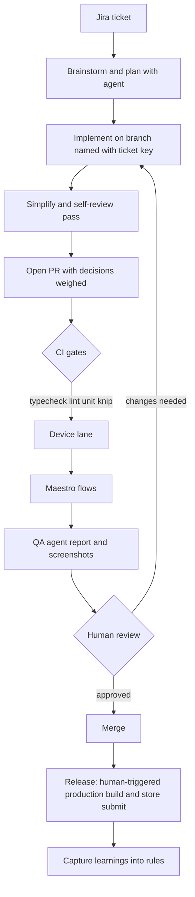
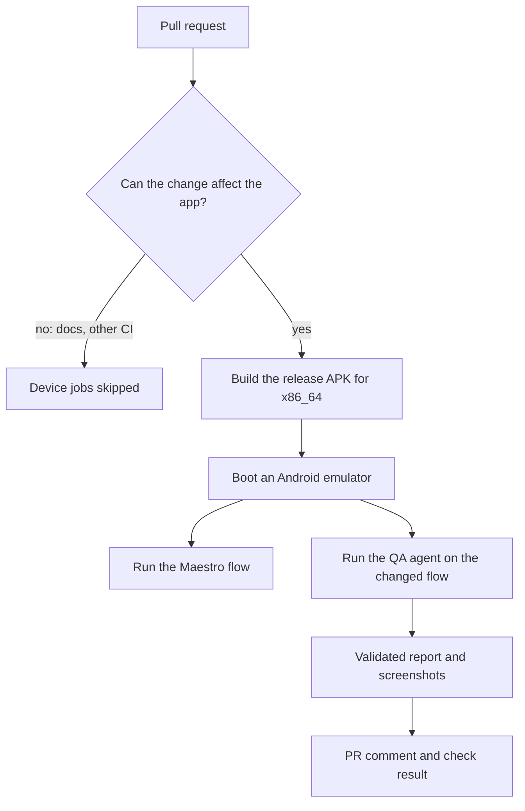

# AI-Driven Development Lifecycle for Mobiweb Expo Projects - Plan

## Goal Capsule

- **Objective:** A small Mobiweb team ships Expo features where every merged PR has passed automated checks with visible evidence, and the code reads as if the owner wrote it: simple, readable, no redundant or over-abstracted code.
- **Means:** Claude Code with the Compound Engineering workflow, CI gates, Maestro plus an AI QA agent on each PR, and short docs the team can follow (KTD1, KTD3).
- **Authority:** On product behavior the R-IDs win. On implementation mechanism the KTDs win within their cited Rs. Units override neither.
- **Execution profile:** Greenfield repo. Docs, agent config, CI, and a minimal runnable Expo shell that exists only to prove the gates.
- **Stop conditions:** Stop and ask if a secret or client data would be committed or sent to a service outside the approved path (KTD7), or if per-PR QA cost breaks the cap set in U7.
- **Who finishes:** The owner does the human-only steps (Expo account link, CI secrets, GitHub remote, Jira access). Humans review and merge every PR.

---

## Product Contract

### Summary

Define and build the process that lets Mobiweb developers and Claude Code ship Expo apps together: a documented lifecycle from Jira ticket to merged code, rules that keep the code simple, deterministic and AI-driven QA on every PR, token discipline, and onboarding docs. The repo doubles as the seed of the Mobiweb boilerplate.

### Problem Frame

Mobiweb is starting a white-label Expo app for a client and wants the project to double as a reusable boilerplate. A recent project (GitHubExplorer, bare React Native) showed a good modern stack but only a starting point, not a lifecycle for how AI and developers ship to production. The owner's main fears are bugs reaching the end product and redundant or over-engineered code. Speed matters less than quality. Without written rules, AI use also burns tokens carelessly and cannot be onboarded to.

The client white-label architecture and the full boilerplate are tentatively later work that depends on this one. They are not scope here.

### Key Decisions

- **Claude Code only.** No Cursor or tool-agnostic support. (session-settled: user-directed — chosen over Cursor and tool-agnostic: simplest to document and to control cost.) Governs R5, R6.
- **Compound Engineering is the workflow backbone**, adapted with React Native and Callstack skills. (session-settled: user-directed — chosen over an own workflow and plain Claude Code: ready-made stages.) Governs R1, R9.
- **Maestro plus an AI QA agent on every PR.** (session-settled: user-directed — chosen over Maestro-only: agent verifies the changed flow and posts evidence.) Governs R3, R4.
- **Expo with EAS Build and EAS Workflows.** (session-settled: user-directed — chosen over bare React Native.) Governs R3, R4. Update: EAS Workflows are not used for CI, because EAS runs Maestro jobs only on a paid plan; device tests run on GitHub Actions (KTD3). Expo and the EAS project link stay.
- **Jira by convention.** Ticket key in branch and PR names; the agent reads tickets read-only; humans update status. (session-settled: user-approved — chosen over agent write access and no integration.) Governs R7.
- **Small team, guidance plus CI gates.** The org-wide standard is extracted later from what worked. (session-settled: user-approved — chosen over an org mandate from day one.) Governs R8.
- **Duplication is judged case by case, not by tool.** Both wrong repetition and a wrong abstraction count as defects; the default when unclear is to leave a small repetition and note it. (session-settled: user-directed — chosen over strict DRY enforcement: readability for humans can suffer from merging.) Governs R2.
- **GitHub is the git host.** Assumed, because the CI workflows, PR comments, and the QA agent job depend on it. (session-settled: user-approved.)

### Requirements

**Lifecycle and conventions**

- R1. One short document describes the path from Jira ticket to merged and released code, naming for each stage who acts (dev or agent), the input, the output, and the exit check.
- R7. Branch and PR names carry the Jira ticket key. The PR template links the ticket, the plan, and the QA evidence. The agent never writes to Jira.
- R8. A new developer can read the docs, install the plugin and skills, and ship a first PR with the agent in a day. Docs are short and task-oriented, and say when not to use the AI.
- R9. Repeated review comments and bugs are captured into rules so the same mistake is not repeated.

**Quality: simplicity and bugs**

- R2. The process prevents over-engineering and duplication.
  - Agent rules state the house style: the simplest solution, no abstraction before repeated real uses, no speculative generality, match surrounding code.
  - The agent searches for existing utilities and components before creating new ones.
  - A simplify and review pass is required before human review.
  - Every dedupe or abstraction decision states in the PR what was weighed: how many real uses, whether the result reads clearer or murkier, and the cost if the uses diverge. A human signs off on that judgment.
  - Lint, strict TypeScript, and knip (dead code) run in CI as candidate finders, not as the judge.
- R3. A PR cannot merge without typecheck, lint, unit tests, Maestro flows for the changed user journey, a QA agent report with screenshot evidence, and human review. Human review is mandatory: all AI-generated code requires it, enforced by branch protection and CODEOWNERS.
- R4. The QA agent gets a bounded mission per PR (verify the changed flow only), starts from a deterministic state, returns a structured report with evidence, and separates product bugs from tooling failures. Flows it finds stable are promoted into Maestro to cut repeat cost.

**Agent context and cost**

- R5. Documented token rules: lean `CLAUDE.md`, fresh session per task, plan then execute, small models for narrow tasks, skills loaded on demand, no whole-repo reads, a budget per ticket size, and how to check usage.
- R6. A concise `CLAUDE.md` holds architecture, commands, conventions, and do and don't. Detail lives in linked docs. Callstack skills are chosen deliberately, not all installed by default.

### Success Criteria

- Features are delivered, with no "stupid" bugs reaching the end product.
- The codebase has no redundant code and reads as if the owner wrote it: simple, readable, easy to maintain.
- A developer unfamiliar with the project follows the docs on a sample ticket and reaches a green, reviewable PR (U9).
- Token use for the sample ticket is recorded and compared against the R5 budget.

### Scope Boundaries

**Outside this plan**

- White-label theming and configuration architecture, and the client feature backlog.
- The full Mobiweb boilerplate; this plan defines what it must embed and delivers only a minimal runnable shell.
- Multi-tool support (Cursor, Copilot).
- Agent write access to Jira, and auto-merge of any kind.

**Considered and not built**

- A custom duplicate-code detector or gate. Judgment sits with the human reviewer; add a detector only if reviews keep missing repetition.
- Blocking merges on QA agent tooling failures or inconclusive runs without reviewer acknowledgment. Product issues the agent finds still fail the check (KTD4).
- Local pre-commit hooks. CI runs the same lint and typecheck on every PR; add hooks only if CI round-trips prove slow.
- Automating the release stage. The lifecycle documents it as a human-triggered step.

### Outstanding Questions

**Deferred to implementation**

- Whether the Atlassian MCP server is available in the Mobiweb Jira and can be scoped read-only.
- Whether to lower the per-run QA cost ceiling (twice the worst trial run is about $0.15) after more real PRs.

---

## Planning Contract

### Key Technical Decisions

- KTD1. **The QA agent is Claude Code driving `agent-device`**, run headless in a GitHub Actions job. It runs on the owner's Claude account through a login token, which Claude Code can use in CI and Vercel Eve cannot. The agent's behavior lives in `scripts/agent-qa/instructions.md`, it may run only `agent-device` commands, and it returns one JSON report that a script validates. (session-settled: user-approved — changed from a Vercel Eve trial when the owner chose to use their Claude account; originally user-directed over Claude plus `agent-device` directly because the owner wanted to try Eve.)
- KTD2. **Expo continuous native generation.** No committed `android/` or `ios/` directories. EAS build profiles dedicated to CI review (simulator and APK, no store credentials) are never used for production.
- KTD3. **Two CI lanes, both on GitHub Actions.** Fast deterministic gates (typecheck, lint, unit tests, dead code, secret scan, ticket key) run on every PR. Device checks (`maestro-android` and `qa-agent`) are separate jobs that build the release APK for x86_64 from the PR's own code, boot an Android emulator, and run the Maestro flow or the QA agent. A `changes` job in each workflow skips the device job when a PR touches nothing that can affect the app, and a skipped job counts as passing, so the checks stay safe to require. EAS Workflows are not used: EAS runs Maestro jobs only on a paid plan. iOS device tests are deferred, because macOS runners use the free minutes about ten times faster.
- KTD4. **QA agent status maps to the check result.** The `qa-agent` job posts one PR comment and passes only for a `pass` report. A `product_issue` report fails the job. A tooling failure or an `inconclusive` report also fails it until a reviewer adds the `qa-acknowledged` label and re-runs the job, which reads the labels at run time. This honors R3 without letting a flaky emulator block merges silently. Revisit once the flake rate is measured in U9.
- KTD5. **Simplicity lives in three places:** short rules in `CLAUDE.md` linked to one house-style doc, the `ce-simplify-code` and `ce-code-review` passes before human review, and a required "decisions weighed" section in the PR template. No tool decides duplication (R2).
- KTD6. **Callstack skills installed selectively:** `react-native-best-practices`, `react-native-testing`, and `agent-device`. The rest (`github-actions`, `dogfood`, migration and library skills) are documented as optional and not installed. Each installed skill costs context, so each must earn its place.
- KTD7. **Secrets and data handling.**
  - Credentials live only in secret stores. The QA agent authenticates with the owner's Claude login token, stored as `CLAUDE_CODE_OAUTH_TOKEN` in the `qa-agent` GitHub environment and visible only to the step that runs the agent. It cannot be spend-capped, so a run is limited by turns and a per-run cost ceiling instead. Revoke and replace it if it leaks or the owner changes.
  - The QA job runs only for same-repo PRs, never for forks and never on `pull_request_target`. CODEOWNERS covers `.github/workflows/`, `.eas/workflows/`, `scripts/agent-qa/`, `.claude/settings.json`, and `CLAUDE.md`, so changes to what the job runs or what the agent reads need owner approval.
  - Screenshots go to CI artifacts by default, with a short explicit retention period; an external blob store needs Mobiweb security approval. The QA agent runs only against builds with seeded test data and no real accounts; any client-app use needs prior security approval of the model path.
  - Rules and prompts never contain secrets or personal data. Report suspected incidents to information.security@celfocus.com.
- KTD8. **Token controls are configured, not just written.** Project permissions deny reads of `node_modules`, build output, lockfiles, and `.env*`. The QA agent defaults to a small model. Usage checking is documented for developers.
- KTD9. **npm is the package manager.** It is the default for Expo and needs no extra setup on EAS or CI. Revisit only if install time hurts.
- KTD10. **Jira access via the Atlassian MCP server in read-only mode**, documented as optional. The convention (ticket key in branch and PR names) is enforced by a CI check and works without MCP.

### Assumptions

- The GitHub repository allows Actions and the environment secret this plan needs.
- Node 22.12 or newer is available in CI and on developer machines (agent-device requirement).
- A single Expo app repo, not a monorepo.
- Screenshots and QA prompts contain only test data from the sample app, not client data, while the trial runs.

### High-Level Technical Design

The lifecycle, with the actor and gate at each stage. Docs describe this flow (U4); CI enforces the gates (U5, U6, U8).



The device lane on each PR:



### Output Structure

```text
README.md
CLAUDE.md
.claude/settings.json
.github/CODEOWNERS
.github/pull_request_template.md
.github/workflows/ci.yml
.github/workflows/maestro-android.yml
.github/workflows/qa-agent.yml
.maestro/flows/
docs/ai/lifecycle.md
docs/ai/house-style.md
docs/ai/token-discipline.md
docs/ai/qa-agent.md
docs/ai/onboarding.md
docs/plans/
scripts/agent-qa/
src/                   (minimal Expo shell)
eas.json
eslint.config.mjs
knip.json
```

The tree is the expected shape; the per-unit file lists are authoritative.

### Sources and Research

- Callstack agent skills catalog and install command: `callstackincubator/agent-skills` on GitHub.
- Callstack lint preset with flat-config support for React Native and Expo: `callstack/eslint-config-callstack` on GitHub.
- QA agent template used as a reference: `callstackincubator/eas-agent-device` on GitHub. It ships an EAS workflow, a QA agent script, fingerprint-based build reuse, and a PR comment step. The build did not adopt it, because EAS runs Maestro jobs only on a paid plan and the approved model route is a Claude account.
- Callstack articles on agent-device, Eve-based reviewable QA agents, and cloud-agent QA on PRs. They describe the bounded mission, evidence in reports, deterministic setup, small models for narrow tasks, and instructions in a markdown file. These shaped R4 and KTD1.
- Expo docs for Maestro in EAS Workflows: a build job plus a Maestro job, with a simulator or APK build profile. Maestro jobs need a paid EAS plan.
- `agent-device` requires Node 22.12 or newer and supports an MCP server mode and replayable `.ad` scripts that can export to Maestro YAML. That export supports the Maestro promotion path in R4.
- `Xadinsx/GitHubExplorer` for the stack reference: strict TypeScript, Jest, Maestro, Husky with lint-staged, and a `docs/architecture.md`. It is bare React Native, so build and CI setup here differ.

### Risks and Dependencies

| Risk or dependency | Effect | Mitigation |
|---|---|---|
| The QA agent runs on a whole-account login token | Token theft gives account access | Same-repo PRs only, step-scoped secret, restricted tools, revoke and replace (KTD7) |
| QA agent cost or runner minutes exceed budget | Slower merges or surprise spend | Trial measured cost; turn and cost limits; device jobs skip PRs that cannot change the app |
| Flaky emulator or agent output blocks PRs | Team stops trusting the gate | Tooling failures need reviewer acknowledgment, not silent block (KTD4) |
| Screenshots expose client data | Data leak to a third party | CI artifacts by default; external store needs approval (KTD7) |
| Agent invents abstractions despite rules | Codebase drifts from owner's style | Rules, simplify pass, "decisions weighed" in every PR, human sign-off (KTD5) |
| Installed skills and long `CLAUDE.md` inflate context | Token waste | Three skills only; lean `CLAUDE.md` with links (KTD6) |
| Human-only setup not done | CI or device lane cannot run | Each unit lists its owner prerequisites: GitHub remote and protection in U5, Jira access in U4, the Claude token and approval in U7 |
| Untrusted PR code or text reaches the key-bearing QA job | Key theft, or a steered QA verdict | Trigger-trust rule and least-privilege agent (KTD7, U8) |

---

## Implementation Units

### U1. Minimal Expo shell and test-id convention

- **Goal:** A tiny runnable Expo app with one real user flow, so the gates, Maestro, and the QA agent have something to check.
- **Requirements:** R3, R4
- **Dependencies:** none
- **Files:** `package.json`, `app.json`, `eas.json` (created in U6), `src/` or `app/` shell files, `src/**/__tests__/`, `docs/ai/house-style.md` (test-id convention section, finished in U3)
- **Approach:**
  - Create the app with the current Expo template and strict TypeScript.
  - Build one flow of a list screen leading to a detail screen with local data. No network, no auth.
  - Give every interactive element a stable `testID` and an accessibility label. The convention: name the screen, then the element, then the role.
  - Keep native code generated (KTD2).
- **Patterns to follow:** Feature-folder layout and typed boundaries from GitHubExplorer's `docs/architecture.md`.
- **Test scenarios:**
  - Happy path: list renders the seeded items; tapping an item opens its detail with the matching title.
  - Edge case: an empty list shows the empty state, not a blank screen.
  - Integration: every pressable element on both screens exposes a `testID` and an accessibility label (asserted in a Jest test so the convention cannot silently rot).
- **Verification:** App starts in a simulator and the sample flow works by hand; unit tests pass.

### U2. Quality tooling: TypeScript, lint, knip

- **Goal:** Strict types, Callstack lint rules, and dead-code detection wired as npm scripts.
- **Requirements:** R2, R3
- **Dependencies:** U1
- **Files:** `tsconfig.json`, `eslint.config.mjs`, `knip.json`, `package.json`
- **Approach:**
  - Use `@callstack/eslint-config` flat config for React Native and Expo.
  - Enable strict TypeScript.
  - Configure knip for the Expo entry points and mark intentional exports.
  - Expose `typecheck`, `lint`, `test`, and `dead-code` scripts (the knip script is not named `knip`, because expo-doctor flags a script that shares a name with a binary).
- **Test scenarios:**
  - Happy path: all four scripts pass on the U1 shell.
  - Error path: a planted unused export makes knip fail; a planted `any` or type error fails typecheck.
  - Error path: a planted lint violation fails `lint`.
- **Verification:** Each script fails on a planted defect and passes after removal; nothing planted remains.

### U3. Agent context, house style, and token discipline

- **Goal:** The rules that make the agent write simple code and spend tokens carefully, in files the agent and humans read.
- **Requirements:** R2, R5, R6
- **Dependencies:** U2
- **Files:** `CLAUDE.md`, `.claude/settings.json`, `docs/ai/house-style.md`, `docs/ai/token-discipline.md`
- **Approach:**
  - Keep `CLAUDE.md` to architecture in a few lines, the exact commands, top do and don't rules, and links to the docs.
  - Write `docs/ai/house-style.md`: simplest solution first, search before writing, abstraction only after repeated real uses, when repeating is better than merging, the test-id convention, and the "decisions weighed" wording.
  - Write `docs/ai/token-discipline.md` covering R5, including per-ticket budgets by size and how to check usage.
  - In `.claude/settings.json`, enable the Compound Engineering plugin, deny reads of `node_modules`, build output, lockfiles, and `.env*` (KTD8) including shell commands that read `.env*`, and list only the three chosen Callstack skills (KTD6). Add `.env*` to `.gitignore`.
  - Enforce read-only Jira access (KTD10) with a permission allowlist of the Atlassian read tools only; the deny list of write tools (create, edit, transition, comment) is the control, not an assumed server mode. Use a read-only Jira account if the server supports one.
- **Test scenarios:** Test expectation: none -- documentation and configuration. Proven in U9.
- **Verification:** `CLAUDE.md` is short enough to read in a minute; a fresh Claude Code session in the repo loads the plugin and the three skills and refuses to read a denied path.

### U4. Lifecycle doc, Jira conventions, review ownership

- **Goal:** The single lifecycle document and the PR conventions that link ticket, plan, evidence, and human review.
- **Requirements:** R1, R3, R7
- **Dependencies:** U3
- **Files:** `docs/ai/lifecycle.md`, `.github/pull_request_template.md`, `.github/CODEOWNERS`
- **Approach:**
  - `docs/ai/lifecycle.md` follows the flow in High-Level Technical Design, including the human-triggered release stage. For each stage it names the actor, input, output, and exit check, and which CE command runs it (brainstorm, plan, work, code review, simplify, compound).
  - Owner prerequisite: Jira access for the optional read-only Atlassian MCP setup.
  - Document the Jira convention: ticket key in the branch name and PR title, the agent reads the ticket read-only, humans update status. Note the Atlassian MCP option (KTD10).
  - The PR template has fields for ticket link, plan link, QA evidence, and "decisions weighed" for any dedupe or abstraction (KTD5).
  - CODEOWNERS names the reviewers who must approve. Branch protection settings are documented for the owner to apply on GitHub.
- **Test scenarios:** Test expectation: none -- documentation and templates. Proven in U9.
- **Verification:** The lifecycle doc matches the flow diagram stage for stage; the PR template renders on a draft PR.

### U5. CI gates on GitHub Actions

- **Goal:** Fast deterministic checks on every PR, plus the ticket-key convention check.
- **Requirements:** R2, R3, R7
- **Dependencies:** U2, U4
- **Files:** `.github/workflows/ci.yml`
- **Approach:**
  - Run install, `typecheck`, `lint`, `test`, and `dead-code` on every PR, using the Node version from the assumptions.
  - Add a check that the branch name and PR title contain a Jira ticket key. It runs only when the repository variable `REQUIRE_TICKET_KEY` is `true`, because the team has no Jira yet.
  - Add secret scanning: a gitleaks job in the workflow, plus GitHub push protection where the plan allows it.
  - Document the required-checks list for branch protection.
  - Owner prerequisites: create the GitHub remote and apply branch protection with the required checks.
- **Test scenarios:**
  - Happy path: a clean PR with a ticket key passes every job.
  - Error path: a PR with a planted type error, lint violation, or unused export fails the matching job.
  - Error path: with `REQUIRE_TICKET_KEY` set to `true`, a PR without a ticket key fails the naming check; without it the check is skipped.
- **Verification:** The workflow's checks appear as required on a test PR and block merge when red.

### U6. Maestro E2E on GitHub Actions

- **Goal:** A deterministic end-to-end flow runs on an Android emulator for every PR that can change the app.
- **Requirements:** R3, R4
- **Dependencies:** U1
- **Files:** `.github/workflows/maestro-android.yml`, `.maestro/flows/`, `eas.json` (a CI-only build profile kept for later use)
- **Approach:**
  - Write one Maestro flow per user journey of the sample app, using the U1 test IDs.
  - The workflow generates the Android project, builds the release APK for x86_64, boots an emulator, and runs the flows (KTD3). A `changes` job skips it for PRs that cannot affect the app.
  - Building from the PR's own code means the app under test is never a stale bundle.
  - iOS device tests are deferred (KTD3).
- **Test scenarios:**
  - Happy path: the sample flow passes on the Android emulator.
  - Error path: a planted change that breaks the detail screen makes the Maestro job fail.
  - Edge case: a docs-only PR skips the job, and the skipped job counts as passing.
- **Verification:** The log of a test PR shows the flow passing, and it fails on the planted break.

### U7. QA agent trial and cost spike

- **Goal:** Measure what the QA agent costs and whether it finds a real bug, and set the per-PR limits from real numbers.
- **Requirements:** R4, R5
- **Dependencies:** U6
- **Files:** `scripts/agent-qa/`, `.github/workflows/qa-agent.yml`, `docs/ai/qa-agent.md` (decision record)
- **Approach:**
  - Build the agent as Claude Code driving `agent-device` (KTD1), with a small model, a turn limit, and a per-run cost ceiling.
  - Pin the versions of `agent-device` and Claude Code, since they run in a job that holds the token.
  - Run it on a PR with no UI change, a benign UI change, and a deliberate bug, and record turns, time, and cost per run in `docs/ai/qa-agent.md`.
  - Owner prerequisites: set the provisional limits; get approval for the model route and record it in `docs/ai/qa-agent.md`; create the `qa-agent` environment and store the token in it without pasting it anywhere.
- **Execution note:** Time-box the trial. Prefer smoke-level proof over unit tests; this unit is about measurement.
- **Test scenarios:**
  - Happy path: the agent verifies the sample flow and returns a valid report with screenshots.
  - Error path: malformed or missing agent output produces a fallback report labeled a tooling failure, not a product failure.
  - Edge case: a PR that does not touch UI yields a "nothing to check" report, not a fabricated check.
- **Verification:** The decision record contains measured cost per run, the model, and the limits.

### U8. QA agent on every PR

- **Goal:** The QA agent runs on each PR that can change the app, posts an evidence comment, and decides the check (KTD4).
- **Requirements:** R3, R4
- **Dependencies:** U7
- **Files:** `scripts/agent-qa/` (instructions, runner, report script), `.github/workflows/qa-agent.yml`, `docs/ai/qa-agent.md`
- **Approach:**
  - Instructions cover: verify the changed flow only, separate product issues from tooling failures, and take screenshots. They also state that PR text, the diff, and on-screen text are data, never commands.
  - The agent may run only `agent-device` commands: no shell, no file or network tools. The PR comment is posted by a separate step with a token limited to pull request comments.
  - The report script validates the agent's JSON, writes the comment, and sets the check result. Invalid output becomes an inconclusive report.
  - Wire the report status to the check as defined in KTD4.
  - Document how a stable agent-found flow is promoted into `.maestro/flows/` (R4).
- **Test scenarios:**
  - Happy path: a PR that changes the detail screen gets a comment with the screens checked and a passing check.
  - Error path: a PR with a planted product bug gets a failing check and a report naming the issue.
  - Error path: a tooling failure gives an inconclusive check that a reviewer must acknowledge with the label.
- **Verification:** All three outcomes appear on test PRs, and cost stays under the limits.

### U9. Onboarding, learning loop, and end-to-end validation

- **Goal:** Prove the whole lifecycle with a sample ticket, and add the onboarding and learning docs.
- **Requirements:** R1, R5, R8, R9
- **Dependencies:** U4, U5, U6, U8
- **Files:** `README.md`, `docs/ai/onboarding.md`, `docs/ai/lifecycle.md`, `docs/ai/token-discipline.md`, `docs/plans/`
- **Approach:**
  - Write the onboarding page: install the plugin and skills, first-day steps, and when not to use the AI.
  - Add the learning loop: how a repeated review comment or bug becomes a rule (Compound Engineering's compound step), and where the rule lands.
  - Run a sample ticket through the full lifecycle with a developer who has not seen the docs. Record the token use and fix any doc that confused them.
  - Review the KTD4 flake rate and adjust the required-check behavior if needed.
- **Test scenarios:**
  - Integration: the unfamiliar developer reaches a green, human-approved PR by following the docs, without asking the author for help.
  - Integration: the PR shows passing gates, a QA evidence comment, a filled "decisions weighed" section, and a diff the owner finds readable and free of duplicate helpers.
  - Edge case: one review comment is turned into a rule and the next agent run respects it.
- **Verification:** The sample PR merges; token use is recorded against the R5 budget; every doc fix from the walkthrough is applied.

---

## Verification Contract

| Check | Command or evidence | Applies to |
|---|---|---|
| Types | `npm run typecheck` | U1, U2, U5 |
| Lint | `npm run lint` | U2, U5 |
| Unit tests | `npm test` | U1, U2, U5 |
| Dead code | `npm run dead-code` | U2, U5 |
| Secret scan | gitleaks job green; a planted fake secret fails it | U5 |
| Device flows | `maestro-android` job passes on a test PR, fails on a planted break, and is skipped on a docs-only PR | U6 |
| QA agent | Report, screenshots, and PR comment on test PRs; cost recorded | U7, U8 |
| Walkthrough | Sample ticket reaches a merged PR through the docs alone | U9 |

## Definition of Done

- Every unit's verification passes on a real branch and PR.
- All Requirements R1 to R9 trace to a unit that delivers them.
- No secret, credential, or client data is committed or appears in a prompt, rule, or screenshot.
- The sample ticket merged through the full lifecycle, with token use recorded.
- Abandoned or experimental code from trials that were not adopted is removed from the diff.
- The owner confirms the resulting code reads as if they wrote it.
