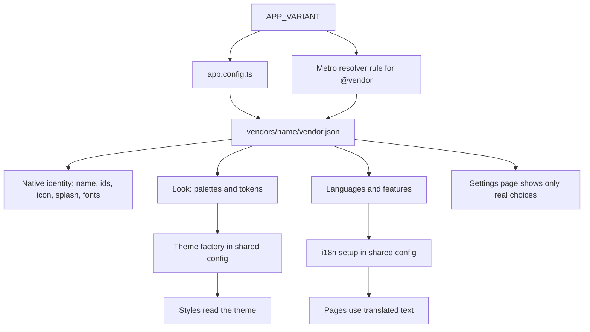
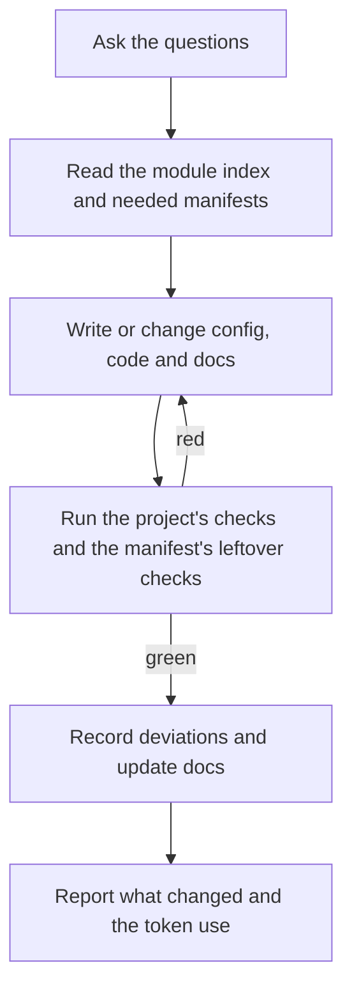

# Configurable Vendor Boilerplate - Plan

## Goal Capsule

- **Objective:** A Mobiweb team starts a client project, and later adds vendors to it, by answering questions. Each vendor's app comes out with its own identity, look, languages and features, and the boilerplate's defaults stay recommendations that a client can decline.
- **Means:** One typed config file per vendor, selected at build time, read by the app's native identity and by a config-driven theme and language setup (KTD1, KTD2, KTD3); modules described by manifests that skills act on (KTD10, KTD12).
- **Product authority:** The R-IDs below. This plan covers the vendor configuration model, the recommended-defaults modules, and the setup skills. The surrounding areas listed under How This Work Fits Together are not active scope.
- **Authority hierarchy:** On product behavior the R-IDs win. On implementation mechanism the KTDs win within their cited Rs. Units override neither.
- **Execution profile:** Existing repo with open PR #17. Config, app code, CI workflows, docs and Claude skills.
- **Stop conditions:** Stop and ask if a vendor config would need a real secret, if a build for one vendor contains another vendor's identity, or if a skill cannot reach green checks and the reason is not clear.
- **Who finishes:** The owner reviews and merges every PR. The owner supplies real vendors, brands and store accounts later; none is needed here.

---

## Product Contract

### Summary

The boilerplate stops deciding things for the app. Each vendor's build declares its own identity, brand, languages and features in one config, and the shared setup only reads it. Optional capabilities (styling, storage, translations, server state, crash reporting and so on) are modules with a company-recommended default that a project can decline or swap. Claude Code skills create a project, add a vendor, and add, remove or swap a module.

### Problem Frame

PR #17 added theming, storage and translations to the boilerplate, but it fixed the choices in the shared code: two themes named light and dark, and English and Portuguese as the only languages. The owner's reaction was that this made the boilerplate a "closed mind": an app has to edit shared code to change a language list or add a vendor brand.

The first client wants a white-label app that other vendors can reuse, with a separate build per vendor. That needs every vendor-specific thing to live in that vendor's config, and it needs a way to create projects and vendors that does not depend on copying the boilerplate and editing it by hand. Clients may also have their own preferences (for example, no Unistyles), so the company defaults need to be recommended and not enforced.

### Key Decisions

- **Separate app per vendor, built at build time.** (session-settled: user-directed — chosen over one app loading vendor settings at runtime, and over doing both: the owner picked it when shown the options.) Governs R1, R2, R3.
- **Everything can differ per vendor:** look, identity, languages, features and backend. (session-settled: user-directed — the owner selected all four.) Governs R1.
- **The setup covers three jobs:** create a project, add a vendor, and add or remove a module. (session-settled: user-directed — chosen over also adding a configuration check command.) Governs R12, R13, R14.
- **Built as Claude Code skills for everything.** (session-settled: user-directed — chosen over a hybrid of a script plus skills, which was the recommendation, and over a deterministic CLI: least code to maintain.) Governs R12, R13, R14, R15, R16.
- **The boilerplate provides mechanisms and each vendor's config holds the choices.** (session-settled: user-approved — chosen over keeping fixed theme names and languages in shared code.) Governs R4, R5, R6, R17.
- **Vendor configuration comes before more stack.** Server state, crash reporting and release automation wait until the module model exists, because they become modules. (session-settled: user-approved.) Governs R8.
- **Recommended defaults, not locks.** The company recommends its defaults and explains why, but a client can decline or replace any of them. The cost is one recorded decision and project-specific rules per deviation. Governs R8, R9, R10, R11.
- **A build carries only its own vendor.** Other vendors' names, brands, URLs and keys never ship in it. Governs R2.

### Requirements

**Vendor configuration**

- R1. Everything that differs between vendors comes from one vendor config: identity (name, icons, splash, store ids), look (brand colors, fonts, logo, spacing and radius tokens, for each color scheme the vendor allows), languages, features, and backend and service keys.
- R2. A build contains only its own vendor's config and assets; nothing in it reveals another vendor's name, brand, URLs or keys.
- R3. One setting picks the vendor, and local development, CI and release builds all honor it.
- R4. A vendor declares which color schemes its app supports (light, dark or both) and whether users can choose; what a screen shows is the vendor's brand in the active scheme.
- R5. A vendor declares its supported languages and the default, including the case of a single language; app text and language setup work with any such list.
- R6. The sample app's settings page offers a language switcher or a theme switch only when the vendor's config gives a real choice.
- R7. The sample vendor reproduces today's sample behavior (both schemes, English and Portuguese), and a second sample vendor (one language, one scheme, its own brand and ids) proves the model works.

**Recommended defaults, not locks**

- R8. Each optional capability is a module with a company-recommended default: styling and theming (Unistyles), storage (MMKV), translations (i18next), server state (TanStack Query), crash reporting (Sentry), release automation (EAS), the QA agent, and the architecture check (Feature-Sliced Design).
- R9. Each module has a manifest stating what it adds (files, dependencies, native config, CI checks, docs), where the rest of the app depends on it, and what changes if it is swapped or removed, so a skill can act on it without reading the whole repo.
- R10. A project may decline or replace any recommended default. The setup states the company recommendation and its reason, accepts the choice, and records it as a deviation decision in the project.
- R11. A project that deviates gets rules, checks and docs that match its choice (no leftover rules for a library it does not use) and passes its own checks.

**Setup skills**

- R12. A create-project skill asks for the project name and ids, the first vendor, and which modules to keep, swap or drop, then produces a project whose config, docs and checks match the answers.
- R13. An add-vendor skill can run at any time on an existing project and, from a vendor's answers, produces that vendor's config, assets, build settings and a working build without touching other vendors.
- R14. A module skill adds, removes or swaps a module in an existing project using its manifest.
- R15. Every skill run ends with the project's checks green, the affected docs updated and any deviation recorded; a skill that cannot reach green reports what is left and does not finish quietly.
- R16. Skills read only the manifests and files they need, in line with the token rules.

**The boilerplate itself**

- R17. The shared theme and language setup no longer hard-codes theme names, language lists or which choices exist; it reads the vendor config.
- R18. The boilerplate's rules and docs present defaults as recommendations, say how to deviate, and list the modules.

### Key Flows

- F1. Add a vendor
  - **Trigger:** A developer runs the add-vendor skill on an existing project.
  - **Steps:** The skill asks for the vendor's identity, look, languages, features and backend; writes the vendor's config and assets; sets up its build; builds it; updates the docs.
  - **Outcome:** A build for the new vendor exists, other vendors are unchanged, and the project's checks are green.
  - **Covered by:** R1, R2, R3, R13, R15
- F2. Create a project with a deviation
  - **Trigger:** A developer runs the create-project skill for a client who does not want Unistyles.
  - **Steps:** The skill asks the questions, states the recommended default and why, accepts the swap, applies the module's manifest for the replacement, and records the deviation.
  - **Outcome:** The project uses the client's choice, has matching rules and docs, and passes its checks.
  - **Covered by:** R8, R9, R10, R11, R12, R15

### Acceptance Examples

- AE1. **Covers R2.** Given two vendor builds, when someone inspects the first build's app bundle and assets, they find nothing of the second vendor's name, colors, URLs or keys.
- AE2. **Covers R5, R6.** Given a vendor that declares one language and one color scheme, when its settings page opens, it shows no language switcher and no theme switch, and all text is in that language.
- AE3. **Covers R10, R11.** Given a client that declines the recommended styling library, when the project is created, the setup names the recommendation, accepts the choice, records a deviation decision, and the project passes its checks with no leftover rules for the declined library.

### Success Criteria

- Adding a vendor takes one skill run and needs no source edit outside that vendor's config and assets; the result is a build with its own name, ids, colors, languages and features.
- Declining a recommended default produces a project that passes all its checks, with the deviation recorded.
- Token use per skill run is recorded so the skills can be tuned (R16).

### Scope Boundaries

**Outside this plan**

- One app that loads vendor settings at runtime after login. The design should not rule it out later.
- The real client's vendors, brands and store accounts.
- A script or CLI generator, and a command that validates vendor configs.
- iOS device tests.
- Pulling later boilerplate improvements into a project that already exists; a project is a copy and evolves on its own.

**Deferred for later**

- Manifests for server state, crash reporting and release automation: each is written when its module is built. This plan writes manifests for the capabilities that exist today (styling, storage, translations, the architecture check, device checks and the QA agent).

### How This Work Fits Together

<!-- ce-section: work-relationships -->

This plan covers the vendor configuration model, the modules, and the setup skills. The broader breakdown is the current understanding, not a committed roadmap.

- The rest of boilerplate v2 (server state, crash reporting, release automation)
  - Depends on this plan: each becomes a module with a manifest.
- The client's white-label app
  - Enabled by this plan: it starts from the create-project skill and adds vendors with the add-vendor skill.
- The rework of PR #17
  - Shares R4, R5, R6 and R17: its theme and language setup becomes config-driven.

### Dependencies and Assumptions

- Assumption: the core that is never optional is the typecheck, lint, test and dead-code checks, CI, secret scanning and the Claude workflow docs (KTD10).
- Assumption: each vendor owns its store developer accounts; the boilerplate only produces builds.
- Assumption: a TypeScript app config can import local TypeScript files, and Metro can redirect a module path by environment variable (Expo's customizing-Metro and app-variants docs).
- Product Contract preservation: unchanged. Planning resolved the questions it deferred; the answers are KTDs.

### Outstanding Questions

**Deferred to implementation**

- Whether a vendor needs its own Expo owner and EAS project id (a vendor that owns its store accounts probably does). The config leaves room for both; the release-automation module decides.
- Custom fonts, token overrides and splash screens for a vendor: added with the modules that need them (R1 lists them as part of a vendor's look and identity).
- Whether the "follow the system color scheme" option is wanted. It is left out of this plan.
- Whether a vendor may override individual text strings for its brand voice. It is left out of this plan.

### Sources

- PR #17 (theming, storage, translations) and `docs/adr/0006-theming-storage-and-translations.md`: the current fixed choices.
- Unistyles documentation on multiple named themes and runtime theme updates: the styling default can support vendor themes.
- `docs/plans/2026-09-29-1517-feat-ai-driven-lifecycle-plan.md`: the process and gates the skills must leave green.

---

## Planning Contract

### Key Technical Decisions

- KTD1. **One typed config file per vendor, holding plain data.** `vendors/<name>/vendor.json` is plain data in the shape of the shared `VendorConfig` type. It is JSON because Expo evaluates `app.config.ts` with Node, which cannot load other TypeScript files (found while building U1). `app.config.ts` checks every field and kind of value when it loads a vendor, and a test checks every vendor folder. It declares identity (name, URL scheme, iOS bundle id, Android package, icon and adaptive icon), look (a palette for each color scheme the vendor supports), color schemes (supported list, default, whether users choose), languages (supported list, default, whether users choose), features (named flags), backend (API base URL), public service identifiers, and an optional `eas` block (owner, project id, slug) for a vendor with its own EAS project. Until a vendor has that block, every vendor uses the boilerplate's EAS project and slug, because Expo checks the app slug against the project's. Custom fonts, token overrides and splash screens are not supported yet; they arrive with the modules that need them. Images and other runtime assets live in `vendors/<name>/runtime.ts`, reached as `@vendor/runtime`, which holds the `require` calls Metro needs. Governs R1, R4, R5.
- KTD2. **The vendor is chosen by the `APP_VARIANT` environment variable**, Expo's documented convention, defaulting to `default`; an unknown value fails with a message naming the vendors that exist. Local runs, CI and EAS profiles all set it. Governs R3.
- KTD3. **Only the chosen vendor is bundled.** `app.config.ts` imports the chosen vendor file for native identity, icons, splash and fonts. In the app, `@vendor/...` imports resolve to `vendors/<APP_VARIANT>/...` through a Metro resolver rule, so Metro only bundles that folder; TypeScript resolves `@vendor` to the `default` vendor for types, and Jest reads `APP_VARIANT` too. The same data file feeds both sides, so which vendor is read cannot disagree; what is type-checked is covered by KTD8. Alternative not chosen: passing config through the app manifest (`extra`) and reading it with `expo-constants`; it works for data but not for images and fonts. Governs R2.
- KTD4. **Theme = vendor palette in the active color scheme.** The shared theme code builds its theme list from the schemes the vendor supports, keys them by the operating system's two scheme names (`light`, `dark`), and takes every color and font from the vendor. The initial scheme is the stored choice if users may choose and it is valid, otherwise the vendor's default. The shared code names no brand color. (session-settled: user-approved — mechanism in shared code, choices in the vendor config.) Governs R4, R17.
- KTD5. **Languages come from the vendor, through one registry.** `src/shared/config/i18n/` holds a registry of the languages the boilerplate ships: each entry has a code, its translation resource and its own-language name ("English", "Português"). A vendor lists the codes it ships, and the settings page builds its language buttons from the registry, so no key exists per language. The initial language is the stored choice if users may choose and it is supported, then the device language if supported, then the vendor default. A vendor with one language gets no switcher. Adding a language is one translation file plus one registry line. Translation files are shared and ship in every build; vendor-private text is not supported. Governs R5, R17.
- KTD6. **The sample settings page renders from the vendor config**: a theme switch only when the vendor supports both schemes and lets users choose, language buttons only when it ships more than one language and lets users choose, and an empty-state message otherwise. Governs R6.
- KTD7. **Vendor-specific device tests live with the vendor.** Shared Maestro flows use `appId: ${APP_ID}`, and flows that only make sense for some vendors sit in `vendors/<name>/maestro/`. The QA agent's app knowledge moves from its shared instructions into `vendors/<name>/qa-notes.md`, and the workflow substitutes the app id. Governs R7.
- KTD8. **CI builds one reference vendor per PR and checks every vendor cheaply.** The repository variable `REFERENCE_VENDOR` (default `default`) picks the vendor the emulator jobs build; other vendors are built on request or before a release. Two checks cover all vendors: the vendors test in `npm test`, which discovers every vendor folder and validates it, and `vendor-isolation` in `checks`. Isolation derives its markers from each vendor's config (name, slug, bundle id, package, URL scheme, API URL, public service ids), requires them to be unique across vendors, exports each vendor's bundle, and fails if another vendor's markers appear in the bundle text or if another vendor's asset files (compared by content hash) appear in the exported assets. (session-settled: user-approved.) Governs R2, R7.
- KTD9. **Vendor config holds public identifiers only.** Anything inside an app can be read, so crash-reporting DSNs and analytics write keys may appear and real secrets never do; secrets stay in CI and on servers. The type and docs say so, and the secret scan still runs. Governs R1.
- KTD10. **A module is a markdown manifest in `docs/modules/`** (`<name>.md`) with front matter naming the capability, the recommended default and why, and sections for what it adds, where the app depends on it, what changes on swap or removal, the rules it contributes, the checks it contributes, and leftover checks. "Where the app depends on it" is given as patterns a skill can search for (import specifiers, config keys, script names, CI step names); file lists are only examples, and a skill compares its search with the manifest and corrects the manifest when they differ. Leftover checks are searches that must return nothing after a removal or swap, and files that must exist after an add. `docs/modules/README.md` is the index, with one line per module and the project's status, so a skill reads the index and only the manifests it needs. Core, never optional: typecheck, lint, tests, dead-code detection, CI, the secret scan, and the Claude workflow docs. Governs R8, R9, R16.
- KTD11. **A deviation is an ADR named `NNNN-deviation-<capability>.md`** stating the recommended default, the chosen alternative, the reason, what the manifest steps changed, and the rules and checks that now differ; the module index links it. Module-specific rules move out of `docs/ai/house-style.md` into their module manifests so a removed module leaves no stale rule. Governs R10, R11, R18.
- KTD12. **Skills are project-scoped Claude Code skills** in `.claude/skills/`: `add-vendor`, `module` (add, remove, swap) and `new-project` (the create-project skill of R12). Each is short, user-invoked only, states its questions and steps, reads the module index and only the manifests it needs, and stops with a list of what is left if it cannot finish. A skill's gate is the project's checks (the core checks plus those of the modules present, and the vendors test) and the manifest's leftover checks; it does not report green while either fails. `new-project` deletes itself and the boilerplate's own plans when it finishes; the boilerplate's ADRs stay as inherited decisions. The folder `vendors/default` is the project's primary vendor for its whole life: `new-project` rewrites its content instead of renaming it, so nothing else refers to a changed name. (session-settled: user-directed — skills for everything over a script or a hybrid.) Governs R12, R13, R14, R15, R16.
- KTD13. **PR #17 is reworked in place.** Its branch `feat/theming-storage-i18n` is still open, so U1 and U2 land on it instead of a new PR, together with the update to ADR 0006 in U2. ADR 0007 and the rest of U4 land in a later PR, because U4 depends on U3. Governs R17.

### High-Level Technical Design

How a vendor reaches a build:



The shape of a vendor config (directional, not a signature):

```text
VendorConfig
  identity   name, slug, scheme, ios id, android id, icon, splash
  look       palettes per supported scheme, token overrides, fonts, logo
  schemes    supported (light, dark or both), default, users choose?
  languages  supported (subset of shipped translations), default, users choose?
  features   named flags
  backend    api base url
  services   public identifiers only
```

What each skill does:



### Output Structure

```text
vendors/
  default/vendor.json
  default/runtime.ts
  default/assets/
  default/maestro/
  default/qa-notes.md
  sample-single/vendor.json
  sample-single/runtime.ts
  sample-single/assets/
  sample-single/qa-notes.md
app.config.ts             (replaces app.json)
metro.config.js
jest.config.js
docs/modules/README.md
docs/modules/styling.md
docs/modules/storage.md
docs/modules/translations.md
docs/modules/architecture-fsd.md
docs/modules/device-checks.md
docs/modules/qa-agent.md
docs/vendors.md
docs/adr/0007-vendor-config-and-recommended-defaults.md
.claude/skills/add-vendor/SKILL.md
.claude/skills/module/SKILL.md
.claude/skills/new-project/SKILL.md
scripts/ci/vendor-isolation.sh
```

The tree is the expected shape; the per-unit file lists are authoritative.

### Sources and Research

- Expo, "Configure multiple app variants": `APP_VARIANT` in a dynamic app config, per-profile `env` in `eas.json`. It does not settle whether variants need separate EAS projects (deferred question).
- Expo, "Customizing Metro": redirecting a module path with `resolver.resolveRequest`; resolutions are not cached, so restart the dev server after changing the environment.
- Unistyles documentation: several named themes, an initial theme, and runtime theme changes, so a vendor palette per scheme fits the styling default.
- The current branch of PR #17: the fixed themes and languages this plan removes.

### Risks and Dependencies

| Risk or dependency | Effect | Mitigation |
|---|---|---|
| A vendor's identity leaks into another vendor's build | Breaks R2; vendor confidentiality | `vendor-isolation` check exports every vendor and searches for the others' strings (KTD8) |
| The Metro rule and TypeScript resolve `@vendor` differently | Types pass but the wrong vendor runs, or the reverse | One vendor file feeds both; U1 proves it with two vendors before building on it |
| Skills vary from run to run | A project ends up inconsistent | Short skills, manifests as the source of truth, and the checks as a gate (KTD12) |
| Swapping a default (for example styling) touches many files | A deviation is expensive or breaks | The manifest lists every usage point and the recipe, and U6 rehearses one swap on a scratch copy |
| Two extra emulator builds per PR if all vendors were tested | Slow, costly CI | One reference vendor per PR (KTD8) |
| Public identifiers in the config are mistaken for secrets storage | A real secret ships in an app | KTD9 in the type, the docs and the secret scan |

---

## Implementation Units

### U1. Vendor config model and selection

- **Goal:** One typed vendor file per vendor, chosen by `APP_VARIANT`, feeding both the native identity and the app, with the sample `default` vendor reproducing today's app.
- **Requirements:** R1, R2, R3
- **Dependencies:** none; works on the `feat/theming-storage-i18n` branch (KTD13).
- **Files:** `vendors/default/vendor.json`, `vendors/default/runtime.ts`, `vendors/default/assets/`, `app.config.ts` (replaces `app.json`; holds the loader and validator), `metro.config.js`, `tsconfig.json`, `jest.config.js` (replaces the `jest` key in `package.json`, which cannot read `APP_VARIANT`), `eas.json`, `package.json` (scripts), `src/shared/config/vendor/` (type and access), `src/shared/config/index.ts`, `docs/vendors.md`, tests beside the new code.
- **Approach:**
  - Define the `VendorConfig` type (KTD1) and the `default` vendor with the current name, ids, colors and the English and Portuguese setup.
  - Convert `app.json` to `app.config.ts` reading the chosen vendor (KTD2), keeping the plugins, router root, EAS project id and owner.
  - Add the Metro rule, the TypeScript mapping and a `jest.config.js` that builds the `@vendor` mapper from `APP_VARIANT` (KTD3).
  - Give the EAS profiles an `APP_VARIANT` value (KTD2) and keep the `default` vendor's EAS profile working; per-vendor profiles are added by the add-vendor skill.
  - Keep the vendor file plain JSON and put runtime image references in `runtime.ts` (KTD1).
  - Document the vendor folder and how to run a vendor in `docs/vendors.md`.
- **Execution note:** Prove the Metro rule first with `expo export` on two throwaway vendor folders before building on it, since resolution differences between Metro, TypeScript and Jest are the main risk.
- **Patterns to follow:** The existing `src/shared/config/` public API and the `expo-router` plugin `root` setting in the current app config.
- **Test scenarios:**
  - Happy path: with `APP_VARIANT` unset, the app config uses the `default` vendor's name and ids.
  - Error path: an unknown `APP_VARIANT` fails with a message that lists the vendors that exist.
  - Integration: a temporary second vendor folder changes the exported bundle's app name and a marker string only when selected.
  - Error path: a vendor with a missing or mistyped field fails the config load and the vendors test with a message naming the field.
  - Integration: `app.config.ts` loads under Node for each vendor, including one whose logo is an image.
- **Verification:** `expo export` works for `default`; the type check rejects an incomplete vendor; the existing tests still pass.

### U2. Config-driven theme, language and settings

- **Goal:** Theme and language setup read the vendor config, with no hard-coded palettes, schemes offered or language lists, and the settings page shows only real choices.
- **Requirements:** R4, R5, R6, R17
- **Dependencies:** U1
- **Files:** `src/shared/config/theme/`, `src/shared/config/i18n/` (including the language registry), `src/pages/settings/ui/SettingsPage.tsx` and its styles and test, `src/app/routes.test.tsx`, `index.ts`, `jest.setup.ts`, `vendors/default/vendor.json`, `docs/features/settings.md`, `docs/adr/0006-theming-storage-and-translations.md` (note the recommendation).
- **Approach:**
  - Build the theme list from the vendor's supported schemes and palettes (KTD4) and choose the initial scheme by the stated rule.
  - Initialize i18n from the vendor's languages with the initial-language rule (KTD5); keep translation files per language.
  - Make the settings page conditional on the vendor config (KTD6) and keep the storage keys and wrapper as they are.
  - Write the theme, language and settings logic as functions that take the vendor config, with the app passing the resolved vendor, so tests can pass fixture configs and exercise several vendors in one run.
  - Update ADR 0006 so it presents its libraries as recommended defaults.
- **Test scenarios:**
  - Happy path: with a fixture vendor that has both schemes and both languages, both switches show, and switching persists.
  - Edge case: a vendor with one language and one scheme shows no switcher and no theme switch (AE2).
  - Edge case: stored language "pt" is ignored when the vendor does not ship it, and falls back to the device language, then the default.
  - Edge case: a stored scheme is ignored when the vendor does not allow users to choose.
  - Error path: a vendor whose default language is not in its supported list fails the type check.
- **Verification:** All theme, language and settings tests pass with two different vendor configs; `npm run fsd` and `npm run dead-code` are clean.

### U3. Second sample vendor and vendor-aware checks

- **Goal:** A second vendor with a different identity proves the model, and CI checks it for isolation while testing one reference vendor.
- **Requirements:** R2, R7
- **Dependencies:** U1, U2
- **Files:** `vendors/sample-single/` (config, assets, QA notes), `vendors/default/maestro/settings-language.yml` (moved), `vendors/default/qa-notes.md`, `.maestro/flows/items-list-to-detail.yml`, `scripts/agent-qa/instructions.md`, `scripts/agent-qa/run-agent.sh`, `.github/workflows/maestro-android.yml`, `.github/workflows/qa-agent.yml`, `.github/workflows/ci.yml`, `scripts/ci/vendor-isolation.sh`.
- **Approach:**
  - Add `sample-single`: one language, light scheme only, its own brand colors, name and ids.
  - Shared Maestro flows use the app id from the environment, and vendor flows move under the vendor (KTD7).
  - The QA agent gets app knowledge from the vendor's notes; both device workflows read `REFERENCE_VENDOR` and pass `APP_VARIANT` (KTD8).
  - Add the `vendor-isolation` check (KTD8) to the `checks` job.
  - Widen the device workflows' path filters to `vendors/`, `app.config.ts`, `metro.config.js`, `jest.config.js` and `babel.config.js`, so a vendor-only change still runs the emulator job.
- **Test scenarios:**
  - Integration: the isolation script passes for both vendors, and fails for each of three planted leaks: another vendor's marker imported through `@vendor`, through a relative path into `vendors/`, and an asset file copied from the other vendor (AE1).
  - Error path: two vendors with the same bundle id or name fail the uniqueness check.
  - Integration: the device jobs run with `REFERENCE_VENDOR` set to `default` and to `sample-single`, and each runs only the flows that vendor has.
  - Edge case: a docs-only PR still skips the device jobs.
- **Verification:** Both vendors export a bundle with their own name and ids; the isolation check is green in CI; the emulator run passes for the reference vendor.

### U4. Module manifests, deviation records and the rules move

- **Goal:** Every existing capability has a manifest with a recommended default, and a project can decline one through a recorded deviation.
- **Requirements:** R8, R9, R10, R11, R18
- **Dependencies:** U2, U3
- **Files:** `docs/modules/README.md` and one manifest each for styling, storage, translations, the FSD architecture check, device checks and the QA agent, `docs/adr/template.md` (deviation variant), `docs/adr/README.md`, `docs/adr/0007-vendor-config-and-recommended-defaults.md`, `docs/ai/house-style.md`, `CLAUDE.md`, `README.md`, `docs/ai/docs-workflow.md`.
- **Approach:**
  - Write each manifest to the KTD10 shape, with usage patterns, the swap recipe and leftover checks; the styling manifest includes the plain `StyleSheet` alternative and states that the theme factory, the settings theme switch, the typing and the Jest setup are rewritten in a swap.
  - Manifests for server state, crash reporting and release automation are written when those modules are built.
  - Move the styling, text, storage and architecture rules out of the house style into their manifests, leaving links (KTD11).
  - Add the deviation ADR shape and ADR 0007 recording the vendor model and the recommend-not-lock decision.
  - `CLAUDE.md` and the README point at the module index.
- **Test scenarios:**
  - Test expectation: none -- documentation. Proven by the skills in U5 to U8, which act on these manifests.
- **Verification:** Every dependency, native plugin, script and CI step in the repo belongs to a module manifest or to the core list (KTD10); a reader can name the recommendation and the reason for each module from its manifest alone.

### U5. Add-vendor skill

- **Goal:** One skill run adds a vendor with config, assets, notes and a passing build, without touching other vendors.
- **Requirements:** R13, R15, R16
- **Dependencies:** U1 to U4
- **Files:** `.claude/skills/add-vendor/SKILL.md`, `docs/vendors.md`. The skill's own edits are limited to the new vendor folder, an `eas.json` profile entry, the `docs/vendors.md` entry, and for a new language one translation file and one registry line.
- **Approach:**
  - The skill asks for identity, look (palettes, fonts, logo), color schemes, languages, features and backend, and notes that service identifiers are public (KTD9).
  - It writes the vendor folder, placeholder assets when none are given, QA notes, builds that vendor's bundle, and runs the checks until green.
  - It updates `docs/vendors.md` and reports the token use.
- **Execution note:** Rehearse on a scratch copy by adding a third vendor and confirming no other vendor's files changed.
- **Test scenarios:**
  - Integration: on a scratch copy, the skill adds a third vendor with a new language file, and the bundle export, isolation check and all project checks pass.
  - Edge case: the skill refuses a vendor name that already exists and a language that has no translation file, and says what to do.
  - Integration: a diff of the scratch copy shows changes only under the new vendor folder, its `eas.json` profile entry, its docs entry, and any new translation file and registry line.
  - Error path: a vendor whose bundle id, name or URL scheme matches an existing vendor is refused.
- **Verification:** The rehearsal ends green with a token count recorded.

### U6. Module skill

- **Goal:** One skill adds, removes or swaps a module in an existing project from its manifest and leaves the project green.
- **Requirements:** R9, R10, R11, R14, R15, R16
- **Dependencies:** U4
- **Files:** `.claude/skills/module/SKILL.md`.
- **Approach:**
  - The skill reads the module index, then only the named manifest, searches the repo for its usage patterns and corrects the manifest if the search differs; for a swap it states the company recommendation and its reason, accepts the choice, applies the manifest's steps, writes the deviation ADR, and updates the index.
  - It removes the module's dependencies, native plugin entries, CI steps, docs and rules, then runs the checks until green.
- **Execution note:** Rehearse three cases on a scratch copy: remove the FSD check, remove the QA agent, and swap styling to plain `StyleSheet`.
- **Test scenarios:**
  - Integration: removing the architecture check leaves no `fsd` script, CI step, config file or house-style rule, and the checks are green (AE3).
  - Integration: swapping styling to plain `StyleSheet` leaves no Unistyles dependency, Babel plugin or mock; a deviation ADR exists; the checks are green; and the U2 scheme and settings tests still pass against both sample vendors (AE2).
  - Integration: after removing a module, the manifest's leftover checks return nothing, and the skill refuses to report green when one is planted (a stale rule left in the house style).
  - Edge case: adding a module that is already present is refused with a message.
- **Verification:** Each rehearsal ends green, with the ADR and index updated and the token count recorded.

### U7. Create-project skill

- **Goal:** One skill turns a fresh copy of the boilerplate into a client project with the chosen first vendor and modules.
- **Requirements:** R12, R15, R16
- **Dependencies:** U5, U6
- **Files:** `.claude/skills/new-project/SKILL.md`.
- **Approach:**
  - The skill asks for the project name and ids, then rewrites `vendors/default` as the client's first vendor using the add-vendor steps (KTD12), and the module steps for each module the client keeps, swaps or drops.
  - It removes the sample vendor and the boilerplate's own plans, updates README and `CLAUDE.md`, then deletes itself (KTD12).
- **Execution note:** Rehearse in a scratch directory made from the boilerplate, including a client that declines Unistyles.
- **Test scenarios:**
  - Integration: the rehearsal ends with the client's ids and name in `vendors/default`, no `sample-single` vendor, no boilerplate plans, no `new-project` skill, no sample name or id left anywhere, and green checks.
  - Integration: declining Unistyles gives a deviation ADR and no leftover Unistyles files or rules (AE3).
  - Edge case: an invalid Android package or bundle id is rejected with an explanation.
- **Verification:** The rehearsal project builds an emulator bundle and passes every check.

### U8. End-to-end validation and token record

- **Goal:** Prove the skills compose on one fresh copy and write the measured token figures into the docs.
- **Requirements:** R15, R16
- **Dependencies:** U5, U6, U7
- **Files:** `docs/modules/README.md`, `docs/ai/token-discipline.md`, `docs/vendors.md`.
- **Approach:**
  - From a clean copy, run one chained sequence: `new-project` with one deviation, then `add-vendor`, then remove one module. Check that the skills compose and that no edits land outside each skill's scope.
  - Copy the token and time figures recorded by the U5 to U7 rehearsals into `docs/ai/token-discipline.md`, and fix any manifest or skill text that misled a run.
- **Test scenarios:**
  - Integration: the chained run ends green with the deviation recorded and no edits outside what each skill should touch.
  - Edge case: a run interrupted before the checks pass reports what is left and does not claim success.
- **Verification:** The token docs contain measured figures, and every doc fix from the runs is applied.

---

## Verification Contract

| Check | Command or evidence | Applies to |
|---|---|---|
| Types | `npm run typecheck` | U1 to U3 |
| Lint | `npm run lint` | U1 to U3 |
| Unit tests | `npm test`; it validates every vendor folder, and vendor behavior is tested with injected fixture configs | U1 to U3 |
| Architecture | `npm run fsd` | U1, U2 |
| Dead code | `npm run dead-code` | U1, U2 |
| Isolation | `scripts/ci/vendor-isolation.sh` passes for both vendors and fails on three planted leaks (import, relative path, asset file) | U3 |
| Device flows | `maestro-android` and `qa-agent` green for the reference vendor | U2, U3 |
| Skill rehearsals | Scratch-copy runs of add-vendor, module (remove and swap) and new-project end green with the manifests' leftover checks clean | U5 to U8 |

## Definition of Done

- Every unit's verification passes on a real branch and PR, or in the scratch rehearsal for the skills.
- All requirements R1 to R18 trace to a unit that delivers them; for R8 and R9 that means manifests for the six capabilities that exist today, with the other three written when their modules are built.
- Two vendors with different identity, brand and languages build from one codebase, and neither build contains the other's identity.
- Declining a recommended default produces a project that passes its checks, with a deviation ADR.
- The token cost of each skill run is recorded in the docs.
- No real secret appears in a vendor config, a manifest or a skill.
- Abandoned or experimental code from the rework of PR #17 is removed from the diff.
