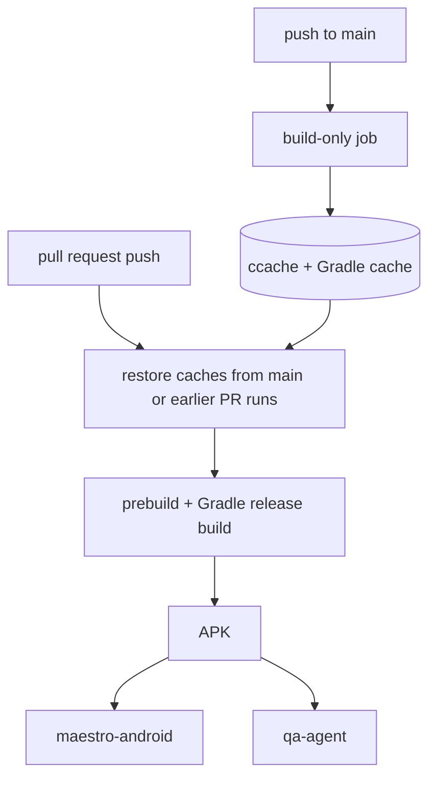

# Tooling Modernization - Plan

## Goal Capsule

- **Objective:** Developers and the agent get check results sooner, and the toolchain the boilerplate ships is current and pinned, so `v0.1.0` can be tagged on it.
- **Product authority:** The requirements and key decisions below. TypeScript 7, oxlint and Jest 30 are not active scope. The first project tag, TanStack Query, Sentry and release automation come after this work.
- **Open blockers:** None.
- **Stop conditions:** Stop and report when a unit's verification fails twice for the same reason, or when pnpm's isolated and hoisted modes both fail the Android build.
- **Execution profile:** Code. Four pull requests, each reviewed by a person; the first (U1 to U3) goes first and the others can merge in any order after it.

## Product Contract

### Summary

Measure first, then change what pays off. Local checks take about 16 s and the CI `checks` job 77 s, so most tools save seconds. The two Android device jobs take 16 to 20 min, of which the native build is 14 min. This work moves the package manager to pnpm as a module with a recommended default, brings ESLint to a current major, pins Node, adds a pre-push hook, and shortens the wait for the device checks.

### Problem Frame

The boilerplate is about to be tagged and copied into client projects, so whatever it ships becomes the starting point of each. The package manager is npm under a lockfile rule (ADR 0005), ESLint is on end-of-life 8.57, Node is not pinned, and no check runs before CI. The largest delay is the device checks: `maestro-android` and `qa-agent` each build the same release APK, 840 s in the measured run, and run in parallel for a 16 to 20 min wait.

TypeScript 7 and oxlint were tested against this repo and did not earn a place now. TypeScript 7 passes `tsc`, Steiger, `knip` and Jest, but ESLint crashes on it until typescript-eslint supports the 7.1 API. A compatibility shim works but saves about 1 s. oxlint saves about 3 s and would run next to ESLint, not replace the Callstack rules.

### Key Decisions

- **Weigh each tool by measured time saved, not by how current it is.** Tools that save seconds are included only when they also fix something else (support status, pinning, reproducibility). (session-settled: user-directed — chosen over adopting the named tools for modernity alone: the measured gain is a few seconds against a 14 min build.) Governs R1 to R9.
- **pnpm is a module with a recommended default, not a core fixed tool.** A client that needs npm or yarn records a deviation, like any other module. (session-settled: user-directed — chosen over fixing pnpm as core: consistent with recommended defaults, not locks.) Governs R1, R2.
- **TypeScript 7 waits for 7.1.** Adoption then needs no shim. (session-settled: user-directed — chosen over adopting now with a compatibility shim: simpler code for about 1 s.) Governs R10.
- **oxlint is skipped for now.** (session-settled: user-directed — chosen over running it next to ESLint: about 3 s saved for a second lint config.) Governs R10.
- **For device checks, time from push to green outranks billed minutes.** (session-settled: user-directed — chosen over minimizing billed minutes: sharing one APK can lengthen the wait.) Governs R7, R8.
- **The hook runs before push, not before each commit.** (session-settled: user-directed — chosen over a pre-commit hook: keeps commits instant, including the agent's many small ones.) Governs R5.

### Requirements

**Package manager**

- R1. The package manager is a module with a manifest in `docs/modules`, with pnpm as the recommended default and the reason, swap and removal steps, and leftover checks. Declining pnpm is recorded as a deviation ADR.
- R2. Local setup, CI, EAS builds, Dependabot, the project skills, the module manifests, README, `CLAUDE.md` and onboarding all use pnpm. A new ADR supersedes ADR 0005.
- R3. pnpm runs in its default isolated mode when every check and the Android build pass under it. When the build fails, the project uses pnpm's hoisted mode and the ADR records why.
- R4. The Node version and the package manager version are pinned in one place that local setup, CI and EAS builds all read.

**Quality gates**

- R5. A pre-push hook runs typecheck, lint, tests, Steiger and `knip`, finishing in under 30 s on a laptop. It installs with the dependencies. CI stays the enforced gate.
- R6. ESLint moves to a current major. When the Callstack config cannot run on a current major, ESLint stays on its supported major and the ADR records why.

**Device checks**

- R7. The wait from push to green for the Android device checks is shorter than the measured 16 to 20 min, mainly by shortening the native build.
- R8. Sharing one APK between `maestro-android` and `qa-agent` is adopted only when it does not lengthen R7's wait.

**Deferred choices and proof**

- R9. The same pull request records CI durations before and after for the `checks` job and both device jobs.
- R10. The ADR that supersedes ADR 0005 records that TypeScript 7 and oxlint were weighed and deferred, with the measured reasons and the trigger to revisit: typescript-eslint supports TypeScript 7.1.

### Acceptance Examples

- AE1. **Covers R3.** Given pnpm's isolated mode fails the Android build in CI, when the cause is symlinked packages, then the project switches to hoisted mode, still on pnpm, and the ADR states the failure.
- AE2. **Covers R6.** Given the Callstack config errors on ESLint 10, when ESLint 9 also fails, then ESLint stays on 8 and the ADR names the failing rule or plugin.
- AE3. **Covers R8.** Given a shared APK makes push-to-green 20 min and separate builds give 17 min, then the jobs keep building separately.
- AE4. **Covers R1.** Given a client wants npm, when the module skill swaps the package manager, then CI, hooks, skills and docs use npm, a deviation ADR exists, and the checks pass.
- AE5. **Covers R2.** Given a fresh copy of the boilerplate, when the `new-project` skill runs, then the project installs, passes every check and has no npm-only command left in its docs or skills.

### Success Criteria

- The timings in R9 show a shorter push-to-green for the device checks, and a `checks` job that is not slower.
- Every check passes on pnpm locally and in CI, and the `new-project` and `module` rehearsals still end green.
- No tool in the boilerplate is on an unsupported major.

### Scope Boundaries

**Deferred for later**

- TypeScript 7, until typescript-eslint supports 7.1.
- oxlint, with the same revisit trigger.
- Jest 30, because `jest-expo` 57 targets Jest 29.

**Outside this work**

- TanStack Query and the API boundary, Sentry, release automation, and tagging `v0.1.0`.

### Dependencies / Assumptions

- Measured baselines: local `tsc` 1.5 s, ESLint 3 s, Jest 4.4 s; CI `checks` 77 s (install 21 s, Jest 15 s, vendor-isolation 25 s); device build 840 s. Taken from the latest runs on 2026-10-01.
- Verified locally on pnpm 11.25: install, typecheck, ESLint, `knip`, Steiger, 40 tests, `expo install --check`, bundle export for both vendors, vendor-isolation and Android prebuild all pass in isolated mode. Not verified: the Gradle build under isolated mode, which only CI can run.
- Unverified: whether the Callstack config runs on ESLint 9 or 10.

### Outstanding Questions

**Deferred to Planning**

- Which native build caching mechanism shortens the 14 min build.
- Which hook tool to use, and the Node version to pin.
- Whether ESLint goes to 9 or 10.

### Sources / Research

- `docs/adr/0005-npm-with-npm-10-lockfile.md`, `docs/modules/README.md`, `.github/workflows/ci.yml`, `.github/workflows/maestro-android.yml`, `.github/workflows/qa-agent.yml`.
- [Expo monorepo guide](https://docs.expo.dev/guides/monorepos/): isolated installs supported from SDK 54, `nodeLinker: hoisted` as the fallback.
- [typescript-eslint#12518](https://github.com/typescript-eslint/typescript-eslint/issues/12518): TypeScript 7 support tracking.

---

## Planning Contract

Product Contract preservation: unchanged.

### Key Technical Decisions

- KTD1. **Four pull requests, cut by concern.** PR A is U1 to U3 (Node and pnpm pins, the pnpm move, the module manifest and ADR). PR B is U4 (ESLint). PR C is U5 (hook). PR D is U6 (device build). U7 (rehearsals) runs after PR A and again after the others. Each is reviewable on its own. PR A and PR D record the CI timings before and after (R9), because they are the ones that can change them. Governs R9.
- KTD2. **One source of truth for versions: `.nvmrc` for Node and the `packageManager` field for pnpm.** CI reads both. `eas.json` cannot read them, so it repeats them, and a Jest test fails when the three disagree. Governs R4.
- KTD3. **pnpm runs in isolated mode first, with hoisted as the recorded fallback.** The fallback is `nodeLinker: hoisted` in `pnpm-workspace.yaml`; pnpm 11 ignores a `node-linker` line in `.npmrc`, which was checked against the pinned version. The decision is made from the CI Android build, not from local checks, which already pass. Governs R3.
- KTD4. **Dependency build scripts are allow-listed explicitly.** pnpm blocks them by default, so any package that needs one (native tooling that downloads or compiles at install) is named in `pnpm-workspace.yaml` after a trial install on the pinned pnpm version shows which. Governs R2.
- KTD5. **The pre-push hook is a script in `.githooks/` activated by `core.hooksPath` from the `prepare` script.** No hook library is added. The script runs the same package scripts as CI's `checks` job minus the install and the isolation check. (see origin: Key Decision on hook stage) Governs R5.
- KTD6. **The device build gets ccache and Gradle caching, seeded from `main`.** The C++ compilation of React Native, Hermes and native modules is the part Gradle cannot cache, so ccache wraps the compilers through CMake's launcher environment variables. GitHub only lets a pull request read caches written by its base branch or itself, so a build-only job on pushes to `main` seeds them. Governs R7.
- KTD7. **Sharing one APK is measured, not assumed.** After caching, U6 compares push-to-green with separate builds against a shared build and keeps the shorter. (see origin: Key Decision on device speed) Governs R8.
- KTD8. **The superseding ADR is ADR 0008.** It replaces ADR 0005, records the deferral of TypeScript 7 and oxlint with the measured numbers, and gives the revisit trigger. Governs R2, R10.

### High-Level Technical Design

How the device build changes (directional):

The two device jobs still build in parallel unless U6's measurement shows a shared build is shorter (KTD7); the diagram shows the cache path, which is common to both choices.

### Assumptions

- The measured baselines in the Product Contract hold: the longest steps are install (21 s), vendor-isolation (25 s), Jest in CI (15 s) and the Gradle release build (840 s).
- `eas.json` can pin Node and pnpm per build profile, and EAS Build installs with pnpm when it finds `pnpm-lock.yaml`. To confirm in U1 against the EAS docs.
- Dependabot's `npm` ecosystem also covers pnpm lockfiles, so `.github/dependabot.yml` (pull request 24) needs no change.
- CMake reads `CMAKE_C_COMPILER_LAUNCHER` and `CMAKE_CXX_COMPILER_LAUNCHER` from the environment, and Android Gradle builds pass the environment through. To confirm in U6 by the ccache hit rate.

### Open Questions

Resolve With the Requester

- **R4 may not be fully meetable.** R4 asks for one place that EAS builds also read. U1 first checks whether EAS reads `.nvmrc` and `packageManager`. If it does not, `eas.json` carries a copy guarded by the drift test, and R4 holds only as "one source of record, with a checked copy". The requester decides whether that wording is acceptable.
- **ESLint may be stuck on an unsupported major.** If neither ESLint 10 nor 9 runs the Callstack config (AE2), ESLint stays on 8, which conflicts with the success criterion that no tool is on an unsupported major. The requester decides between accepting an ADR-recorded exception and replacing the lint config.

### Risks & Dependencies

- **pnpm and Gradle autolinking.** Symlinked packages could break the Android build in CI (AE1). Mitigation: the hoisted fallback in KTD3, decided in the first CI run of PR A.
- **ESLint major versus the Callstack config.** The config accepts `>=8.1` but is untested on 9 and 10 (AE2). Mitigation: try 10, then 9, then stay on 8 with the reason recorded.
- **Cache variance.** Recent maestro runs ranged 806 to 1019 s, so one run proves nothing. Mitigation: compare medians of at least three runs (R9).
- **Pull request 24 (Dependabot)** is open and independent; it merges before or after without conflict.

### Considered and not built

- **Fingerprint-keyed APK reuse with a JavaScript swap** (for example the young `rn-build-cache` project). It could skip the native build entirely for JavaScript-only changes, but it is at version 0.1.0 and re-signs APKs. Revisit when it matures or when ccache falls short of R7.
- **Gradle configuration cache.** `expo prebuild` regenerates `android/` on every run, so the saving is small and the config-plugin interaction is untested.
- **EAS compiler cache.** It needs a paid EAS plan, which ADR 0003 rules out for device checks.
- **A Jest test for the pre-push hook.** The hook runs the test suite, so a test that runs the hook would run itself. The manual verification in U5 covers it.
- **A shared remote ccache service.** The `actions/cache` directory is enough for one repository.

### Deferred to Implementation

- The exact `eas.json` field names for the Node and pnpm pins.
- Which dependency build scripts need the allow-list (KTD4); the trial install in U2 shows them.
- Whether the seeding job (U6) needs a path filter, once the first real cache sizes are known.

---

## Implementation Units

### U1. Pin Node and the package manager

- **Goal:** Local setup, CI and EAS builds use the same Node and pnpm versions, read from one place.
- **Requirements:** R4.
- **Dependencies:** None.
- **Files:** `.nvmrc`, `package.json`, `eas.json`, `.github/workflows/ci.yml`, `.github/workflows/maestro-android.yml`, `.github/workflows/qa-agent.yml`, `docs/ai/onboarding.md`, `test/tooling/versions.test.ts`.
- **Approach:**
  - Add `.nvmrc` with the Node 22 major and an `engines.node` range in `package.json` that matches it.
  - Add `packageManager` with the exact pnpm version used in this repo (11.25.0 at the time of planning).
  - Point each `setup-node` step at `node-version-file: .nvmrc`.
  - Check the EAS docs for whether builds read `.nvmrc` and `packageManager`. When they do, add nothing to `eas.json`; when they do not, pin `node` and `pnpm` in the profile and keep the drift test below. Record which case applies (see the R4 question in Open Questions).
  - Add the drift test: it reads `.nvmrc`, `package.json` and `eas.json` and fails if they disagree.
- **Execution note:** Write the drift test first and watch it fail on a deliberately mismatched `eas.json`.
- **Patterns to follow:** `vendors/vendors.test.ts` for reading repo files in Jest.
- **Test scenarios:**
  - Happy path: with matching pins, the test passes.
  - Error path: `eas.json` names a different Node major than `.nvmrc`, and the test fails with a message naming both values.
  - Error path: `packageManager` names a pnpm version that differs from `eas.json`, and the test fails.
  - Edge case: `engines.node` range excludes the `.nvmrc` major, and the test fails.
- **Verification:** The drift test passes and fails as above. CI's Node comes from `.nvmrc`.

### U2. Move the project to pnpm

- **Goal:** Every install, script, workflow and tool call uses pnpm and passes in CI.
- **Requirements:** R2, R3, R4.
- **Dependencies:** U1.
- **Files:** `package.json`, `pnpm-lock.yaml` (new), `package-lock.json` (removed), `.gitignore`, `pnpm-workspace.yaml` (new; holds the build-script allow-list and, if needed, the hoisted setting), `.github/workflows/ci.yml`, `.github/workflows/maestro-android.yml`, `.github/workflows/qa-agent.yml`, `scripts/ci/vendor-isolation.mjs`, `.claude/settings.json`, `README.md`, `CLAUDE.md`, `docs/ai/onboarding.md`, `docs/ai/lifecycle.md`, `docs/ai/house-style.md`, `docs/vendors.md`, `docs/modules/architecture.md`, `docs/modules/styling.md`, `docs/modules/translations.md`, `.claude/skills/add-vendor/SKILL.md`, `.claude/skills/module/SKILL.md`, `.claude/skills/new-project/SKILL.md`.
- **Approach:**
  - Import the dependency tree with `pnpm install` from the current manifest and commit `pnpm-lock.yaml`; delete `package-lock.json`.
  - Run a trial install without `--ignore-scripts`, list the packages whose install scripts pnpm blocks, and allow-list the ones that need them (KTD4).
  - In each workflow add `pnpm/action-setup` (version from `packageManager`) before `setup-node`, set `cache: pnpm`, and replace `npm ci` with a frozen-lockfile install.
  - Replace `npx` with `pnpm exec` in workflow steps and in `scripts/ci/vendor-isolation.mjs`, and `npm run` with `pnpm` script calls in docs and skills.
  - Keep `npx expo install --check` as `pnpm exec expo install --check`.
  - Update the `changes` job filter in `maestro-android.yml` and `qa-agent.yml` to match `package.json`, `pnpm-lock.yaml`, `pnpm-workspace.yaml`, `.npmrc` and `.nvmrc`, and drop `package-lock.json`, so a dependency-only change still builds the app.
  - For the global tool install in `qa-agent.yml`, use `pnpm add -g` after `pnpm setup` with the global bin directory on the path.
  - In `.claude/settings.json`, swap the `Read(./package-lock.json)` deny rule for `Read(./pnpm-lock.yaml)`.
  - Do not add a registry setting to any `.npmrc`; the lockfile for registry packages carries no registry URL, which replaces ADR 0005's lockfile rule.
  - Finish by fixing every hit of `rg -n 'npm|npx'` outside ADR history (the file list above is the expected set, not the limit).
  - Decide isolated or hoisted from the first CI run of the Android build (KTD3), writing `nodeLinker: hoisted` to `pnpm-workspace.yaml` when needed.
- **Execution note:** Verify the Android build in CI before touching docs and skills; if the build fails, apply the hoisted fallback first.
- **Patterns to follow:** The existing workflow layout in `.github/workflows/ci.yml`.
- **Test scenarios:**
  - Integration: `ci.yml` `checks` passes with a frozen-lockfile install from a clean cache.
  - Integration, covers AE1: the `maestro-android` Android release build passes under isolated mode, or fails and passes after the hoisted line is added.
  - Integration: `vendor-isolation` passes for both vendors under pnpm.
  - Error path: changing `package.json` without updating `pnpm-lock.yaml` fails CI at install.
  - Edge case: `pnpm install` on a clean machine prints no blocked-build-script warning for a package the app needs.
  - Edge case: a pull request that changes only `pnpm-lock.yaml` still runs `maestro-android` and `qa-agent`.
- **Verification:** Every CI job passes on pnpm, `package-lock.json` is gone, and no command in the repo's workflows, scripts, skills or docs uses npm except in historical ADR text.

### U3. Package-manager module and the superseding ADR

- **Goal:** The package manager is a module with a recommended default, and the decision to move is recorded.
- **Requirements:** R1, R2, R10.
- **Dependencies:** U2.
- **Files:** `docs/modules/package-manager.md` (new), `docs/modules/README.md`, `docs/adr/0008-pnpm-and-deferred-tooling.md` (new), `docs/adr/0005-npm-with-npm-10-lockfile.md` (status line only), `docs/adr/README.md`, `docs/ai/lifecycle.md`.
- **Approach:**
  - Write the manifest in the shape `docs/modules/README.md` defines: pnpm as the recommended default with the reason, what it adds, search patterns for where the project depends on it, swap and removal steps for npm and yarn, the rules it carries, checks, and leftover searches that must return nothing after a swap.
  - Write ADR 0008: the decision, alternatives (npm, pnpm hoisted, TypeScript 7 with the shim, oxlint), the measured numbers from the Product Contract, and the revisit trigger (typescript-eslint supports TypeScript 7.1).
  - Mark ADR 0005 superseded by 0008, and add the index rows.
- **Patterns to follow:** `docs/modules/storage.md` for the manifest shape; `docs/adr/0007-vendor-config-and-recommended-defaults.md` for the ADR.
- **Test scenarios:**
  - Test expectation: none -- documentation. Proven by U7, where the module skill swaps pnpm for npm from this manifest.
- **Verification:** Every pnpm-specific rule lives in the manifest, and the ADR names the numbers and the revisit trigger.

### U4. ESLint on a current major

- **Goal:** ESLint is on a supported major with the same rules passing.
- **Requirements:** R6.
- **Dependencies:** U2, U3.
- **Files:** `package.json`, `pnpm-lock.yaml`, `eslint.config.mjs`, `docs/adr/0008-pnpm-and-deferred-tooling.md`.
- **Approach:**
  - Try ESLint 10, then 9, with `eslint-import-resolver-typescript` and the Callstack config at their current versions.
  - If the Callstack config errors, record the failing rule or plugin and keep ESLint on the last major that works; add the reason to ADR 0008 (AE2).
  - Fix lint errors the new major reports only when they are real defects or mechanical; do not disable rules to get green.
- **Execution note:** Run the linter on the unchanged code first and record the baseline error count (zero) so any new report is attributable to the upgrade.
- **Test scenarios:**
  - Integration, covers AE2: `pnpm lint` reports zero errors on ESLint 10; if it does not, on ESLint 9; if neither, the ADR names the failure and ESLint stays on 8.
  - Edge case: the `steiger.config.mjs` override in `eslint.config.mjs` still applies after the upgrade.
- **Verification:** `pnpm lint` passes in CI on the chosen major, with no rule disabled to achieve it.

### U5. Pre-push hook

- **Goal:** A push runs the quick checks locally and fails before CI when one fails.
- **Requirements:** R5.
- **Dependencies:** U2.
- **Files:** `.githooks/pre-push` (new), `package.json`, `CLAUDE.md`, `docs/ai/onboarding.md`, `docs/ai/lifecycle.md`.
- **Approach:**
  - Add the script: run typecheck, lint, tests, Steiger and `knip` through their package scripts, stop at the first failure, and print which check failed.
  - Add a `prepare` script that sets `core.hooksPath` to `.githooks` and does nothing when the folder is not a git checkout.
  - Document it, and add one line to `CLAUDE.md` telling the agent not to skip it with `--no-verify`.
- **Patterns to follow:** The `checks` job order in `.github/workflows/ci.yml`.
- **Test scenarios:**
  - Test expectation: none -- a script of a few lines, and a Jest test that ran it would run the test suite from inside the test suite. Proven by the checks below.
- **Verification:**
  - A push with a deliberate lint error is rejected locally and names the lint check; a clean push passes.
  - `prepare` outside a git checkout (a tarball install) exits 0.
  - One timed run on a laptop finishes in under 30 s, and the number goes in the pull request.

### U6. Shorter wait for the device checks

- **Goal:** Median push-to-green for the Android device checks is at least 25% below the baseline.
- **Requirements:** R7, R8, R9.
- **Dependencies:** U2.
- **Files:** `.github/workflows/maestro-android.yml`, `.github/workflows/qa-agent.yml`, `.github/workflows/native-cache.yml` (new, build-only job on `main`), `docs/ai/lifecycle.md`, `docs/modules/device-checks.md`.
- **Approach:**
  - Record the baseline first, per job, as the median of the last successful runs that built the app: about 910 s for `maestro-android` (six runs, 806 to 1019 s; the build step 840 s). `qa-agent` has fewer samples and runs longer, 987 to 1243 s. The Product Contract's 16 to 20 min is the range of single runs; the target uses medians.
  - Install ccache and set `CMAKE_C_COMPILER_LAUNCHER`, `CMAKE_CXX_COMPILER_LAUNCHER` and `CCACHE_COMPILERCHECK=content`, as React Native's build-speed guide requires on CI; persist the ccache directory with `actions/cache`. All three workflows use one key scheme: a shared prefix plus the lockfile hash, a run-id suffix on the seeding job so each push to `main` saves a fresh entry, and a prefix `restore-keys` so a lockfile change still restores the nearest earlier cache.
  - Keep `gradle/actions/setup-gradle`, and let the seeding job write its cache (it writes only on the default branch). Make the Gradle cache found by the two device jobs by giving the three workflows the same cache key prefix, and read the hit rate on the first run before measuring.
  - Add `native-cache.yml`: on push to `main`, build the release APK and discard it, to seed both caches.
  - After caching, measure a shared-APK variant against separate builds and keep the shorter (KTD7, AE3).
- **Execution note:** Measure before and after on the same PR with at least three runs each; a single run is not evidence.
- **Technical design:** See the High-Level Technical Design in the Planning Contract.
- **Test scenarios:**
  - Integration: on a warm cache the Gradle build step is shorter than the 840 s baseline, and `ccache -s` in the log shows a hit rate above 50%.
  - Integration, covers AE3: the shared-APK variant is adopted only if its median push-to-green is lower than separate builds.
  - Error path: on a cache miss (first run after a lockfile change) the job still passes, only slower.
  - Edge case: a docs-only change still skips both device jobs.
  - Edge case: a fork PR gets no cache write and no secrets, and the QA agent job stays skipped as before.
- **Verification:** Before merge, the median of three warm runs on the pull request (its own cache) is at least 25% below that job's baseline median, for `maestro-android` at most 680 s, or the PR reports the measured result and why the target was not reached. The seeded-from-`main` path cannot be seen before merge, so the first pull requests after merge are checked against the same target and the result is added to `docs/ai/lifecycle.md`.

### U7. Rehearse the skills on pnpm

- **Goal:** The three project skills still start a project, add a vendor and change a module on the new tooling, including declining pnpm.
- **Requirements:** R1, R2, AE4, AE5.
- **Dependencies:** U3 (and re-run after U4 to U6 merge).
- **Files:** `.claude/skills/new-project/SKILL.md`, `.claude/skills/module/SKILL.md`, `.claude/skills/add-vendor/SKILL.md`, `docs/ai/token-discipline.md`.
- **Approach:**
  - On throwaway copies, run `/new-project` and check the project installs, passes every check and has no npm-only command in its docs or skills (AE5).
  - On a second copy, run `/module` to swap pnpm for npm: a deviation ADR, an npm lockfile, working workflows and hooks, and the manifest's leftover searches clean (AE4).
  - Fix any skill or manifest text that misled a run; add the run costs to `docs/ai/token-discipline.md`.
- **Execution note:** Headless runs cannot approve recursive deletes or edits under `.claude/`; give confirmations in the prompt, as the earlier rehearsals did.
- **Test scenarios:**
  - Integration, covers AE5: a fresh copy passes `pnpm install`, typecheck, lint, tests, Steiger, `knip` and `vendor-isolation`, and contains no `npm ci`, `npx -y npm@10` or `package-lock.json`.
  - Integration, covers AE4: after the swap to npm, the package-manager manifest's leftover searches return nothing and a deviation ADR exists.
  - Error path: a planted `pnpm` mention in a file the manifest does not list is found and removed by the skill.
- **Verification:** Both rehearsals end green, and their costs are in the token record.

---

## Verification Contract

| Check | Command or evidence | Applies to |
|---|---|---|
| Types | `pnpm typecheck` | U1 to U7 |
| Lint | `pnpm lint` | U1 to U7 |
| Unit tests | `pnpm test` (includes the version drift test) | U1 |
| Architecture | `pnpm fsd` | U2 to U5 |
| Dead code | `pnpm dead-code` | U2 to U5 |
| Isolation | `pnpm vendor-isolation` | U2, U7 |
| Install | `pnpm install --frozen-lockfile` from a clean cache in CI | U2 |
| Android build | `maestro-android` and `qa-agent` green on pnpm | U2, U6 |
| Timings | CI durations for `checks`, `maestro-android` and `qa-agent`, median of at least three runs, before and after | U2, U6 |
| Hook | A deliberate lint error is rejected on push; one timed run under 30 s | U5 |
| Skill rehearsals | Scratch-copy runs of `new-project` and `module` (swap to npm) end green | U7 |

The script names above are the package scripts after U2; until then they are the `npm run` equivalents.

## Definition of Done

- Each unit's verification passes on a real branch and pull request, or in the throwaway-copy rehearsal for U7.
- R1 to R10 trace to a unit: R1, R2 to U2 and U3; R3 to U2; R4 to U1; R5 to U5; R6 to U4; R7, R8 to U6; R9 to the timings in U2 and U6; R10 to U3 and U4.
- Every pnpm-specific rule lives in the package-manager manifest, and no stale npm instruction remains in docs, skills or workflows outside historical ADRs.
- The measured before and after timings are in the pull requests, and the device wait is shorter or the pull request explains why not.
- Abandoned or experimental changes from trials (a failed ESLint major, a rejected cache layout) are removed from the diff.
